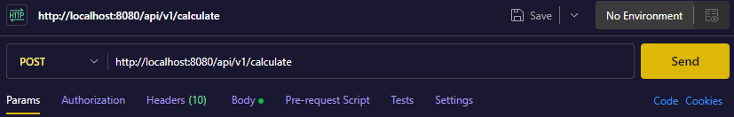
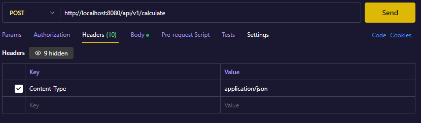
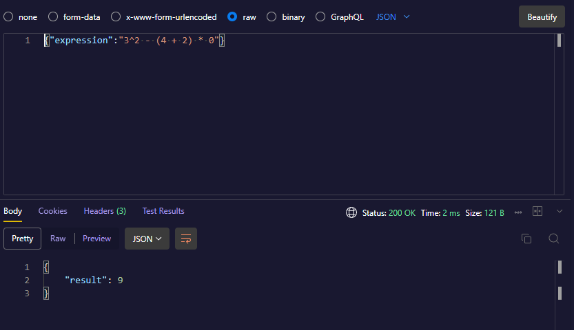

# Калькулятор

Я сделал веб-сервис, который выполняет вычисление арифметических выражений. Он предоставляет API-эндпоинт, куда пользователь может отправить арифметическое выражение и получить результат. Он состоит из оркестратора и агентов, работающих совместно для обработки вычислительных задач. Также в нем присутствует авторизация и регистрация пользователей.

## Архитектура

- Оркестратор: принимает запросы от клиентов, распределяет вычислительные задачи между агентами и собирает результаты.
- Агент: выполняет вычисления и возвращает результаты оркестратору.

## API Эндпоинт

Этот эндпоинт принимает арифметическое выражение, распределяет его выполнение между агентами и возвращает результат или сообщение об ошибке.

#### Регистрация пользователя
```curl -X POST http://localhost:8080/api/v1/register \
  -H 'Content-Type: application/json' \
  -d '{"login":"your_login","password":"your_password"}'
```
Можно заменить **login** и **password** на любой другой

Если не работает, можно попробовать вот эту комманду:
```
Invoke-RestMethod -Method Post -Uri http://localhost:8080/api/v1/register `
  -ContentType "application/json" `
  -Body '{"login":"your_login","password":"your_password"}'
```

#### Авторизация и получение JWT-токена
```
TOKEN=$(curl -s -X POST http://localhost:8080/api/v1/login \
  -H 'Content-Type: application/json' \
  -d '{"login":"alice","password":"secret"}' \
  | jq -r .token)
```

#### Отправка выражения на вычисление
```
curl -X POST http://localhost:8080/api/v1/calculate \
  -H "Authorization: Bearer $TOKEN" \
  -H 'Content-Type: application/json' \
  -d '{"expression":"2+2*2"}'
```
expression: арифметическое выражение, которое может содержать цифры, операторы **+** , **-** , * , **/** , **^** , **()**.

#### Список всех выражений пользователя
```
curl http://localhost:8080/api/v1/expressions \
  -H "Authorization: Bearer $TOKEN"
```

#### Получение одного выражения по ID
```
curl http://localhost:8080/api/v1/expressions/1 \
  -H "Authorization: Bearer $TOKEN"
```

#### Тело ответа (200 - успешно получен список выражений)

#### Тело ответа (ошибка 422 - неверное выражение)

Эта ошибка возникает, если выражение содержит недопустимые символы или синтаксические ошибки.

#### Тело ответа (ошибка 500 - внутренняя ошибка сервера)


## Как использовать программу

1. Клонируй репозиторий
```
git clone https://github.com/VaDKustiK/yandex-golang-course.git
```

2. Установи все зависимости
```
go mod init github.com/VaDKustiK/yandex-golang-course
```

3. Важно перед выполнением перейти в /calculator_service командой:
```
cd yandex-golang-course/calculator_service
```

4. Запускай
```
go run main.go
```
**HTTP-сервер** запустится на порте **8080**

**gRPC-сервер** на порте **9090**

## Postman

**(туториал старый можешь в целом не обращать на него внимание тк я не проверял его работу в нынешнем проекте)**

- После запуска сервера через ```go run main.go``` открывай расширение Postman

- Нажимай **New HTTP request**

- Выбирай POST и пиши ```http://localhost:8080/api/v1/calculate```


- Переходи в **Headers** и пиши ```Content-Type: application/json``` как на скриншоте снизу


- Переходи в **Body**, нажимай **raw** и справа выбирай **JSON**. После этой процедуры можно писать запросы (как показано на скриншоте) и нажимать кнопку **SEND**, чтобы их отправить

